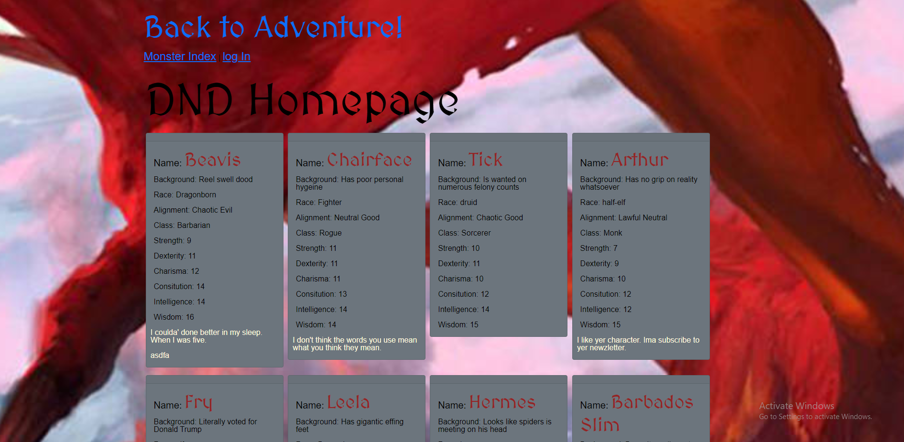

# DND Character creater:

    
    Link to deployable app! https://dnd-creator.herokuapp.com/

## Table of Contents

* [Description](#Description)
* [Usage](#Useage)
* [Installation](#Installation)
* [Node Modules](#Node_Modules)
* [Contributing](#Contributing)
* [Liscense](#license)

## Description

    This website will allow you to create a simple DND character, see other people characters, and comment your thoughts about them.

    The homepage displays a feed of all the charaters that have been created and who they were created by. They also show whos commented on the character.

    When you login you will be taken to the homepage and be greated by a welcome and have the option to create a character. Once created you will then have the option to delete your character. The character cards will also be hidden behind a link so that you can better see your charecters and which ones you want to view. 

    There is also a monster index on the page that you can use to look up monsters. The index will put out a monsters stats, abilities, and other important information.

    The website uses sessions and will be timed out automatically after a certain amount of time.

    The website uses MYSQL to create a datbase that stores the websites data for future use.

## Usage

    The site is used to create a simple DND character and look up information about monsters.

## Installation
    Once you have cloned the repo down from GitHub, you will want to run npm install in the command line to install of the Node Mondules needed to run the application. 

## Node_Modules

* [bcrypt](https://www.npmjs.com/package/bcrypt)

* [connect-session-sequelize](https://www.npmjs.com/package/connect-session-sequelize)

* [dotenv](https://www.npmjs.com/package/dotenv)

* [express](https://www.npmjs.com/package/express)

* [express-handlebars](https://www.npmjs.com/package/express-handlebars)

* [express-session](https://www.npmjs.com/package/express-session)

* [mysql2](https://www.npmjs.com/package/mysql2)

* [sequelize](https://www.npmjs.com/package/sequelize)

## Contributing

- JacobBeckfeld
- YueshiaVue
- JChosay

## license 

© 2021 Awsome group of people. All Rights Reserved

